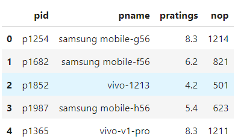
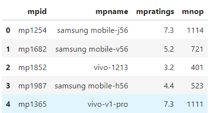
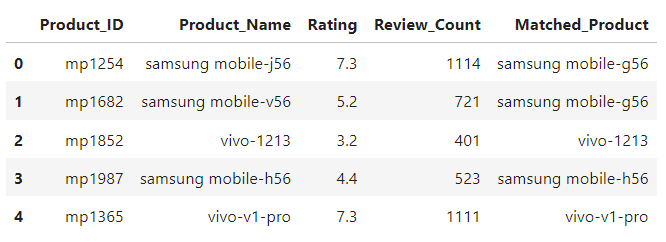
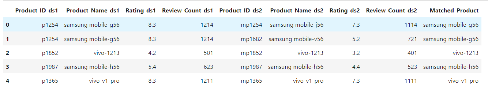
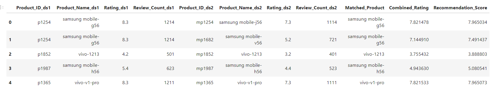
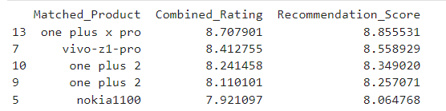
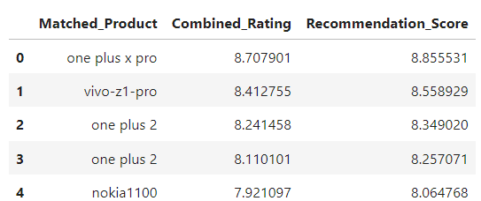

# App_DS_Exno-03

**AIM:**

To Implement Recommendation Systems using the suitable data sets.

**ALGORITHM:**

STEP 1: Load the necessary Datasets.

STEP 2: Include the necessary python library.

STEP 3: Use Fuzzy library for handling text data.

STEP 4: Perform Data Preprocessing Steps.

STEP 5: Standardize column names for merging.

STEP 6: Apply fuzzy matching to find similar text data between datasets.

STEP 7: Perform Data transformation between datasets.

STEP 8: Define a recommendation score using the features of the datasets.

STEP 9: Sort the data by recommendation score.

STEP 10: Export the results to a CSV file.


#### PROGRAM:
```
Developed by: Manoj Kumar S
Register no: 212221230056
```

#### Importing necessary libraries:
```
import pandas as pd 
import numpy as np
from fuzzywuzzy import process
from sklearn.preprocessing import MinMaxScaler
```

#### Reading the datasets:
```
da=pd.read_csv('emobile.csv')          
da.head()
```



```
db=pd.read_csv('maxmobile.csv')          
db.head()
```


#### Data Cleaning and Column Renaming:

```
da.drop_duplicates(inplace=True)
db.drop_duplicates(inplace=True)
da.columns=['Product_ID','Product_Name','Rating','Review_Count']
db.columns=['Product_ID','Product_Name','Rating','Review_Count']
```

#### Fuzzy Matching Function Definition:

```
def matching(name,choice,l=1):
    results=process.extract(name,choice,limit=l)
    return results[0][0] if results else None
```

#### Applying Fuzzy Matching to Identify Corresponding Products:

```
db['Matched_Product'] = db['Product_Name'].apply(lambda x: matching(x, da['Product_Name'].tolist()))
db.head()
```


#### Merging Datasets Based on Fuzzy Matches:

```
merged=pd.merge(da,db,left_on='Product_Name',right_on='Matched_Product',
                how='inner',suffixes=('_ds1','_ds2'))
merged.head()
```


#### Calculating Combined Ratings and Review Counts:

```
merged.columns
x=merged['Review_Count_ds1']+merged['Review_Count_ds2']
merged['Combined_Rating']=(merged['Rating_ds1']*merged['Review_Count_ds1']+
                           merged['Rating_ds2']*merged['Review_Count_ds2'])/x
merged.head()
```



#### Identifying Top Products by Recommendation Score:

```
best=merged.sort_values (by='Recommendation_Score', ascending=False)
print(best[['Matched_Product', 'Combined_Rating', 'Recommendation_Score']].head(5))
```



#### Saving the Best Recommendations:
```
best[['Matched_Product','Combined_Rating',
      'Recommendation_Score']].to_csv('BestRecommended.csv',index=False)
new=pd.read_csv('BestRecommended.csv')
new.head()
```



**RESULT:**

Thus, the Implementation of the Recommendation System for the given dataset is completed successfully.